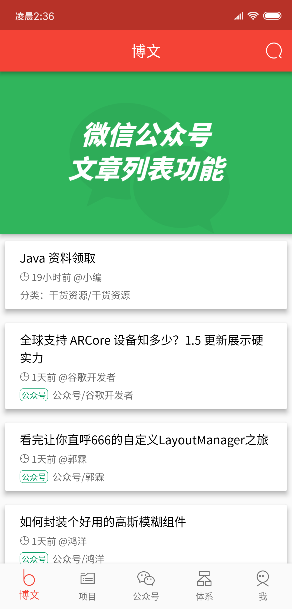
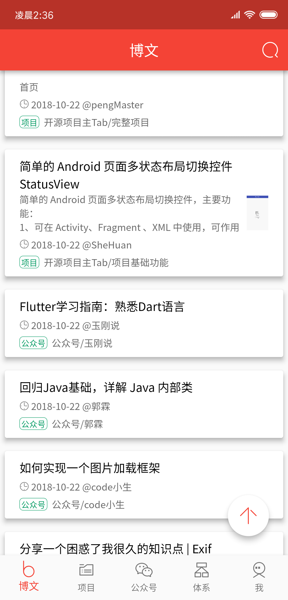
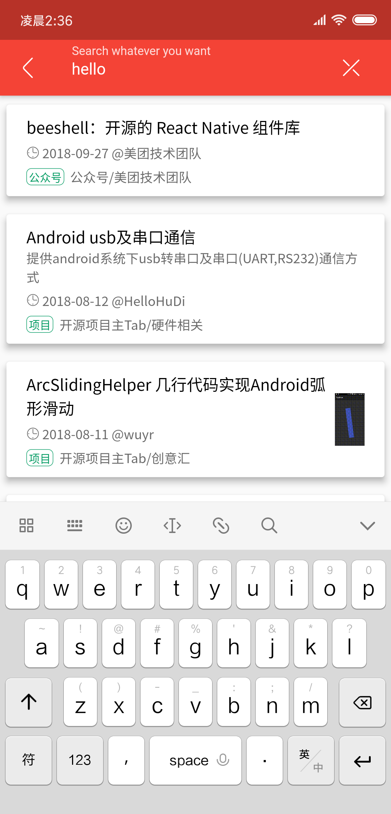
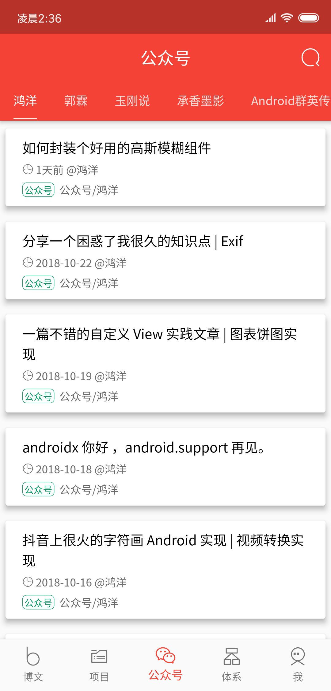
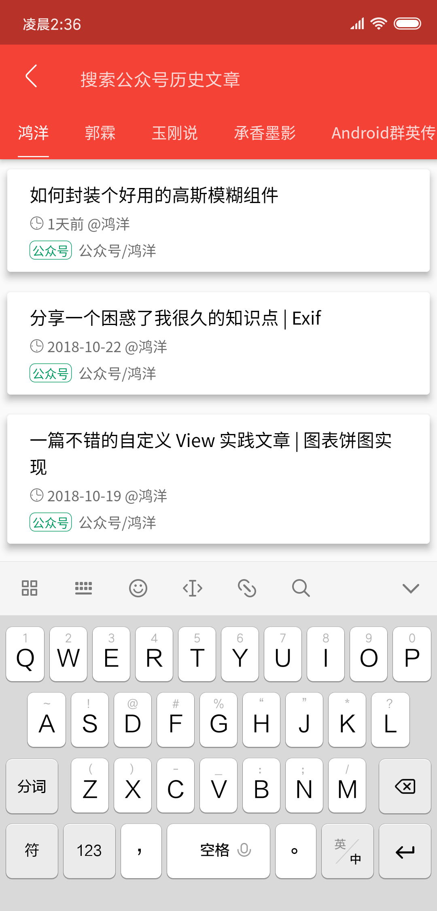
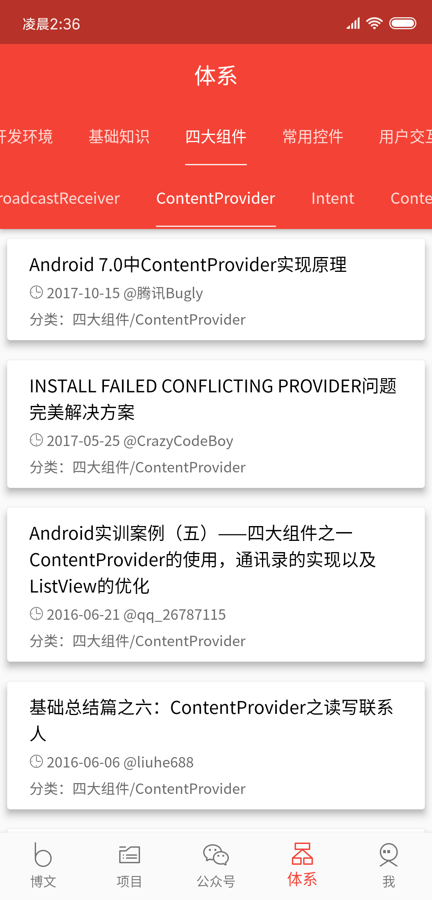
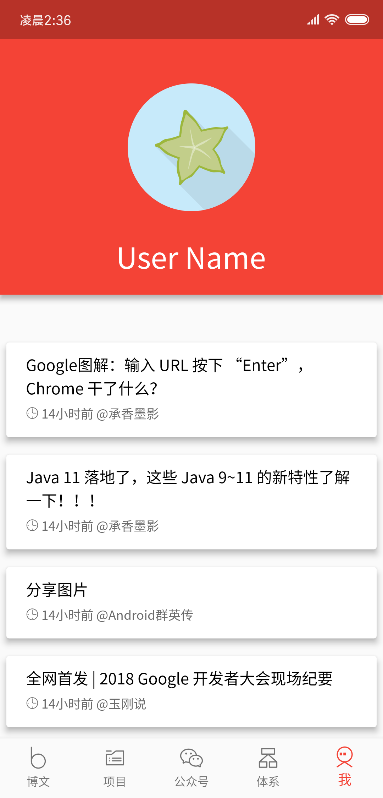
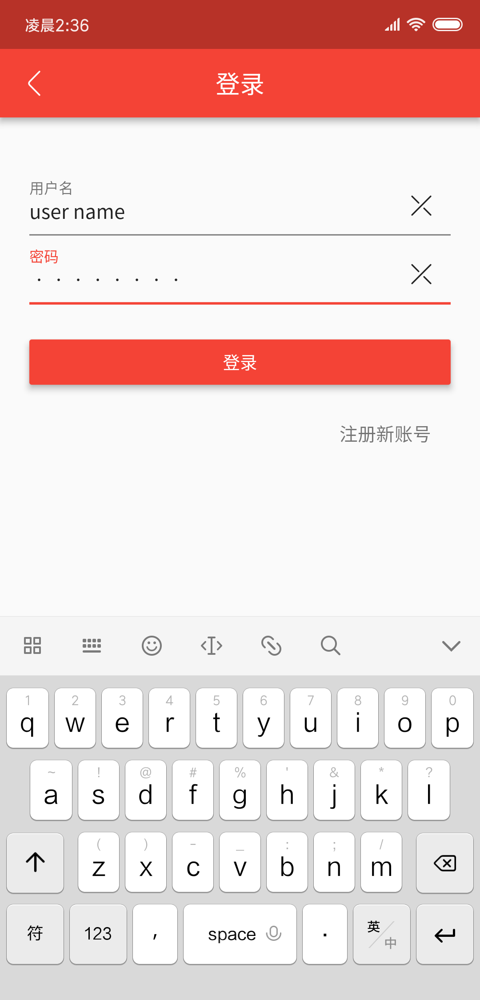

# WanAndroid
* 一款使用[`Flutter`](https://github.com/flutter/flutter)编写的，[`Material Design`](https://flutter.io/widgets/material/)风格的[`WanAndroid`](http://wanandroid.com/)客户端，
* `WanAndroid`官网：[wanandroid.com](http://wanandroid.com/)
* `Api`:[`WanAndroid`开放`API`](http://wanandroid.com/blog/show/2)

### Download
* `Android`: [APK 下载](https://github.com/hurshi/wanandroid/releases)
* `iOS`: 不上AppStore要安装到设备比较麻烦，有需要的就自己编译使用吧。(我自己就是在iOS设备上使用的😁)
* 严重推荐编译使用`Release`版，要比`Debug`版流畅甚多

### Build
* 我的运行环境(2018-11-01)：
	1. 我本地`flutter`版本是`v0.10.2-pre.130`,在`flutter master branch`,[`flutte sdk-archive`](https://flutter.io/sdk-archive/#macos)
	2. 如遇到[issue 1](https://github.com/hurshi/wanandroid/issues/1)中的问题，多半是因为版本号的问题，可以将本地`flutter`切换到`master`上去试试看。
	3. `flutter doctor`
	
		```
		➜  ~ flutter doctor
		Doctor summary (to see all details, run flutter doctor -v):
		[✓] Flutter (Channel master, v0.10.2-pre.130, on Mac OS X 10.14.1 ******, locale
		    zh-Hans-HK)
		[✓] Android toolchain - develop for Android devices (Android SDK 28.0.3)
		[✓] iOS toolchain - develop for iOS devices (Xcode 10.1)
		[✓] Android Studio (version 3.2)
		[!] IntelliJ IDEA Ultimate Edition (version 2018.2.5)
		    ✗ Flutter plugin not installed; this adds Flutter specific functionality.
		    ✗ Dart plugin not installed; this adds Dart specific functionality.
		[✓] VS Code (version 1.28.0)
		[✓] Connected device (1 available)

		! Doctor found issues in 1 category.

		```
* `Android`:[@ Flutter Android Release Page](https://flutter.io/android-release/)
	
	```
	cd wanandroid/
	flutter build apk
	adb install build/app/outputs/apk/release/app-release.apk
	```
* `iOS`:[@ Flutter iOS Release Page](https://flutter.io/ios-release/)
		
	```
	cd wanandroid/
	flutter build ios
	In Xcode, open Runner.xcworkspace in wanandroid/ios folder.
	run...
	```
* `Font`:`App`中自定义了字体[NotoSansCJKsc](https://www.google.com/get/noto/)，导致软件增大了13MB,在意的话可以直接在[pubspec.ymal](pubspec.yaml)中移除。
* 编译不通过的可以参考[issue 1](https://github.com/hurshi/wanandroid/issues/1),如果还没解决可以再提哈。


### ScreenShots
 | |  
:-------------------------:|:-------------------------:|:-------------------------:
  |   |  
  |   |  

### 来讲讲踩过的坑
1. 使用`NestedScrollView`的话，里面的`ListView`不能设置`controller`,需要使用`NotificationListener`，见 [stackoverflow](https://stackoverflow.com/a/51017562)
2. 在上面的基础上，没有了`controller`如何实现类似于`controller.animateTo()`的功能呢？，答案是直接使用外面那个`NestedScrollView`的`controller`
3. `TabBarView`中嵌套`TabBarView`,在左右滑动子`TabBarView`的时候，当子`TabBarView`没得滑得时候，自动滑动父`TabBarView`。如何实现，我还没找到合适的方法，知情人士务必告知呀。

### Thanks
* All the dependent libraries [pubspec.ymal](pubspec.yaml)
* Thanks to [WanAndroid](http://wanandroid.com/)
* Thanks for sara's [icon](sources/icon.ai) and [iconfont.cn](http://www.iconfont.cn/)
* Thanks to [NotoSansCJKsc by Google](https://www.google.com/get/noto/)


### License

   ```
   Copyright 2018 Hurshi

   Licensed under the Apache License, Version 2.0 (the "License");
   you may not use this file except in compliance with the License.
   You may obtain a copy of the License at

       http://www.apache.org/licenses/LICENSE-2.0

   Unless required by applicable law or agreed to in writing, software
   distributed under the License is distributed on an "AS IS" BASIS,
   WITHOUT WARRANTIES OR CONDITIONS OF ANY KIND, either express or implied.
   See the License for the specific language governing permissions and
   limitations under the License.
   ```
